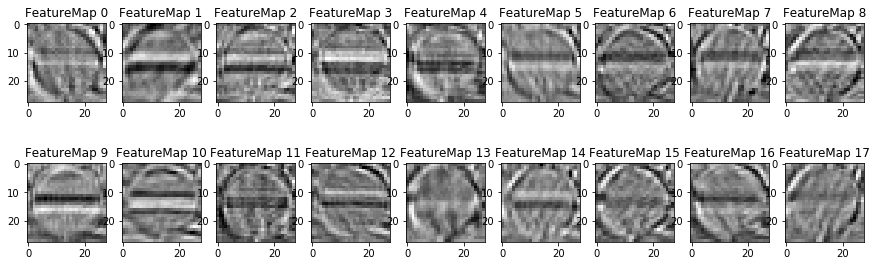
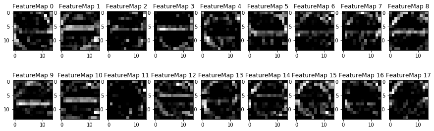
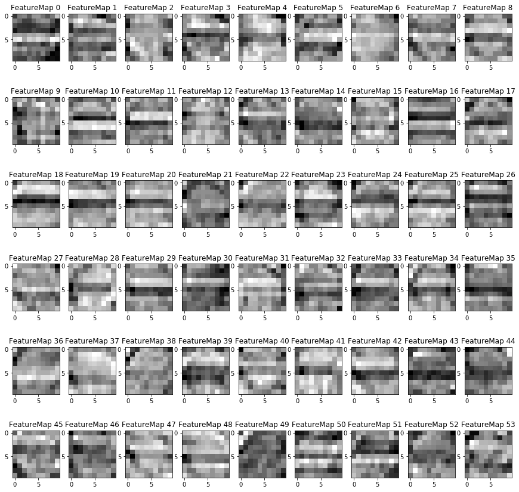
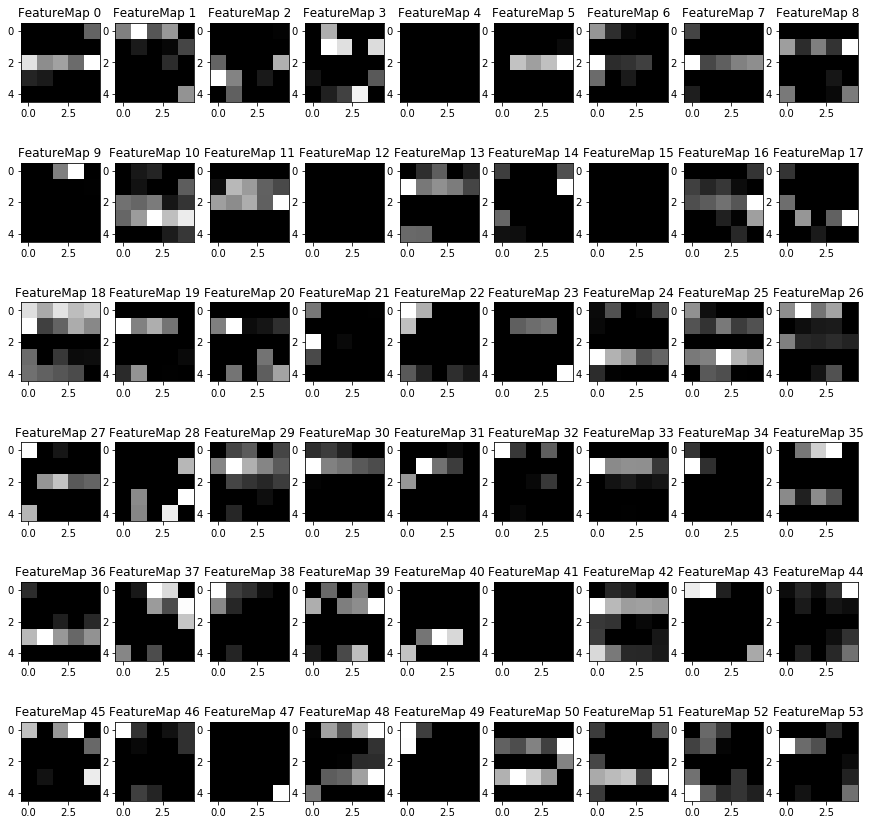

# **Traffic Sign Recognition** 

**Build a Traffic Sign Recognition Project**

The goals / steps of this project are the following:
* Load the data set (see below for links to the project data set)
* Explore, summarize and visualize the data set
* Design, train and test a model architecture
* Use the model to make predictions on new images
* Analyze the softmax probabilities of the new images
* Summarize the results with a written report

[//]: # (Image References)

[image1]: ./output_img/class_bar_chart.png "Bar chart"
[image2]: ./output_img/class_visualize.png "original image"
[image3]: ./output_img/histogram_equalize.png "Histogram equalization"
[image4]: ./output_img/normalize.png "Normalization"
[image5]: ./output_img/new_images.png "New images"
[image6]: ./output_img/new_images_preprocess.png "New images histogram equalization"
[image7]: ./output_img/new_images_normalize.png "New images normalize"
[image8]: ./output_img/new_images_top5.png "New images top 5 prediction"

## Rubric Points
### Here I will consider the [rubric points](https://review.udacity.com/#!/rubrics/481/view) individually and describe how I addressed each point in my implementation.  

---
### Writeup / README

#### 1. Provide a Writeup / README that includes all the rubric points and how you addressed each one. You can submit your writeup as markdown or pdf. You can use this template as a guide for writing the report. The submission includes the project code.

You're reading it! and here is a link to my [project code](./Traffic_Sign_Classifier.ipynb)

### Data Set Summary & Exploration

#### 1. Provide a basic summary of the data set. In the code, the analysis should be done using python, numpy and/or pandas methods rather than hardcoding results manually.

I used the python library to calculate summary statistics of the traffic
signs data set:

* The size of training set is `34799`
* The size of the validation set is `4410`
* The size of test set is `12630`
* The shape of a traffic sign image is `(32,32,3)`
* The number of unique classes/labels in the data set is `43`

#### 2. Include an exploratory visualization of the dataset.

Here is an exploratory visualization of the data set. It is a bar chart showing how the data distributed. The minumum class is `0(180 datas)`, while the maximum class is `2(2010 datas)`. 

![bar chart][image1]

### Design and Test a Model Architecture

#### 1. Describe how you preprocessed the image data. What techniques were chosen and why did you choose these techniques? Consider including images showing the output of each preprocessing technique. Pre-processing refers to techniques such as converting to grayscale, normalization, etc. (OPTIONAL: As described in the "Stand Out Suggestions" part of the rubric, if you generated additional data for training, describe why you decided to generate additional data, how you generated the data, and provide example images of the additional data. Then describe the characteristics of the augmented training set like number of images in the set, number of images for each class, etc.)

First I tried to train the model using only normalizing preprocessed image. The normalized input image contains 3 channels, and each channel (r, g, b) used the same normalizing step. The model got an validation accuracy around 94%. In [this paper](http://yann.lecun.com/exdb/publis/pdf/sermanet-ijcnn-11.pdf) that mentioned in the instruction, the grayscaled image has higher accuracy than colored images. So in the second run, the `rgb2gray()` function was used to train the module (hence the model input depth changed from 3 to 1), and the accuracy does raised around 1%. Finally, the `histogram_equalize()` function that used `cv.createCLAHE()` better identified the grayscaled image. Input image size 32 x 32 looks clear under the default CLAHE filter size described in [doc](https://docs.opencv.org/master/d5/daf/tutorial_py_histogram_equalization.html). After histogram equalization, the images was normalized and the trained model accuracy raised around 1%.

Here is an example of a traffic sign image before and after histogram equalization.

![original][image2]
![Histogram equalization][image3]

As a last step, I normalized the image data because it makes the image to evenly spread from the minimum to maximum. Since the image has been histogram equalized, the result is similar as previous step.
![normalize][image4]

The preprocess steps are listed below, which is applied to all train, validation, and test data: 
* grayscale
* histogram equalization
* normalize 

#### 2. Describe what your final model architecture looks like including model type, layers, layer sizes, connectivity, etc.) Consider including a diagram and/or table describing the final model.

My final model consisted of the following layers:

| Layer         		|     Description	        					| 
|:---------------------:|:---------------------------------------------:| 
| Input         		| 32x32x1 preprocessed image   					| 
| Convolution 5x5     	| 1x1 stride, valid padding, outputs 28x28x18 	|
| RELU					|												|
| Max pooling	      	| 2x2 stride,  outputs 14x14x18 				|
| Convolution 5x5	    | 1x1 stride, valid padding, outputs 10x10x54   |
| RELU					|												|
| Max pooling	      	| 2x2 stride,  outputs 5x5x54				    |
| Fully connected		| output 480        							|
| Fully connected		| output 360        							|
| Fully connected		| output 43, logits       						|
| Softmax				| softmax cross entropy with logits     		|
| Reduced mean          | calculate the loss as the input of optimizer  |

#### 3. Describe how you trained your model. The discussion can include the type of optimizer, the batch size, number of epochs and any hyperparameters such as learning rate.

To train the model, I used an `tf.train.AdamOptimizer`, which is suitable for sparse input data because of the adaptive learning-rate method according to the [overview of gradient descent optimization algorithms](https://ruder.io/optimizing-gradient-descent/index.html) with the following:
| hyperparameters       |     Value     | 
|:---------------------:|:-------------:| 
| Batch size        	| 64   			| 
| learning-rate     	| 0.001 	    |
| Epoch					| 20			|

#### 4. Describe the approach taken for finding a solution and getting the validation set accuracy to be at least 0.93. Include in the discussion the results on the training, validation and test sets and where in the code these were calculated. Your approach may have been an iterative process, in which case, outline the steps you took to get to the final solution and why you chose those steps. Perhaps your solution involved an already well known implementation or architecture. In this case, discuss why you think the architecture is suitable for the current problem.

My final model results were:
* training set accuracy of `100.0%`
* validation set accuracy of `97.9%` 
* test set accuracy of `96.7%`

An iterative approach was chosen:
* LeNet was the first architecture that was tried as suggested
* The model was trained with different preprocessed images. First the image was normalized with its 3(r, g, b) channel. Hence, the fist convolutional layer input depth was 3.
* The width and height of both convolutional layers were `5x5`. According to [this paper](https://arxiv.org/abs/1409.1556) a 5x5 convolutional layer can be sustituted with 2 `3x3` layers and with less parameter, since the input data is small (32x32) so one 5x5 layer was choosed.
* The output layer of the first convolutional layer was 108 according to the [reference paper](http://yann.lecun.com/exdb/publis/pdf/sermanet-ijcnn-11.pdf). Comparing to the accuracy with output depth of 18, there is no significant different, so the output depth changed to `18` to reduce the parameters. Therefore the 2nd convolutional layer output is set as triple of the first convolutional layer depth to `54`.
* Followed by several hyperparameters expiriments. The `learning-rate` is best from `0.0007 to 0.001`. In average, the `batch size` of `64` is slightly better than `128`, and the `Epoch` of `20` is slightly better than `10`. It is noticed that larger `batch size` should pair with larger `learning-rate` for better convergence.
* No observable improvement when testing the 2nd full connected layer input of (720~360) and output of (480~240) because the preprocessing is not apply to all data.
* Before preprocessing validation data and testing data, there was large variation in accuracy which was hard to surpass 90%. It is necessary to apply the same preprocess not only to the training data, but also validation and testing data.
* It is necessary to `shuffle` all data every epoch to prevent uneven training. This should be applied for both uneven distributed data and augmented data. The randomized input provide the possibility of approaching less entropy.
* A less depth is choosed for every layer to prevent overfitting with a small training data set.
* Adding preprocessing of `Grayscale` and `histogram equalization`, each raised the accuracy around 1%.

So the `LeNet` architecture accuracy was around 97% on training. Some steps not included but can further improve the model are listed: 
* The [reference paper](http://yann.lecun.com/exdb/publis/pdf/sermanet-ijcnn-11.pdf) connected both 1st and 2nd convolutional layer output to full connected layer to capture not only high level global feature but also low level feature.
* Augment dataset by adding some random shift and twisted pictures to make the model more robust to angle, posture, and resolution. 
 
### Test a Model on New Images

#### 1. Choose five German traffic signs found on the web and provide them in the report. For each image, discuss what quality or qualities might be difficult to classify.

Here are five German traffic signs that I found on the web:

![new images from the web][image5]

Preprocessing(histogram equalization):
![histogram equalization][image6]
Preprocessing(normalization):
![normalization][image7]

The difficulties of classifying each images are listed below: 
class No.     | 17    | 11   | 2                | 18                   | 5  | 13 | 14 | 22                              | 12 | 1
:------------:|:------|:-----|:-----------------|:---------------------|:---|:---|:---|:--------------------------------|:---|:------------------
description   | NA    |  NA  | rotated image | partial edge was cut | additional board below the sign | NA | NA | additional board below the sign | NA | additional letter and box

#### 2. Discuss the model's predictions on these new traffic signs and compare the results to predicting on the test set. At a minimum, discuss what the predictions were, the accuracy on these new predictions, and compare the accuracy to the accuracy on the test set (OPTIONAL: Discuss the results in more detail as described in the "Stand Out Suggestions" part of the rubric).

Compare the original training samples and the pridiction result:
class No.         | 17  | 11   | 2    | 18   | 5    | 13   | 14  | 22  | 12   | 1
:----------------:|:---:|:----:|:----:|:----:|:----:|:----:|:---:|:---:|:----:|:----:
training samples  | 990 | 1170 | 2010 | 1080 | 1650 | 1920 | 690 | 330 | 1890 | 1980
correct prediction| T   | T    | F    | F    | T    | T    | T   | F   | T    | F
description       |     |      | mis-classify rotated `5` as `arrow` or `3` or `8` because no training of rotated input | loss triangle shape information | | | the probability was low | mis-classify `bump` as `2 cars` for similar shape | | mis-classify  
The model was able to correctly guess 6 of the 10 traffic signs, which gives an accuracy of 60%.
The result shows the input images should be captured properly, no cut off and no additional feature.

#### 3. Describe how certain the model is when predicting on each of the five new images by looking at the softmax probabilities for each prediction. Provide the top 5 softmax probabilities for each image along with the sign type of each probability. (OPTIONAL: as described in the "Stand Out Suggestions" part of the rubric, visualizations can also be provided such as bar charts)

The code for making predictions on my final model is located in the 26th cell of the Ipython notebook.

Here are the results. Each column is the result of 10 input new images. The first row is the preprocessed input, and the top 5 prediction of each image shows from the 2nd to the 6th row, along with its probability:
![top5][image8]

The input images has pretty high resolution so the softmax probabilities of the right classified images were close to 100% while those of mis-classified images were with low probabilities except for class `5` and `14` might mis-classified in some training results.

### (Optional) Visualizing the Neural Network (See Step 4 of the Ipython notebook for more details)
#### 1. Discuss the visual output of your trained network's feature maps. What characteristics did the neural network use to make classifications?

Take the class No.`17(No entry)` as example.

The 1st convolutional layer picked the contour of the sign 

Add the bias. The result is vary similar to the previous multiplication result. Showing that the bias value is vary small. 

Max pooling reduced size 

The 2st convolutional layer represent the overall contrast of the image. Each layer with the different value of grayscale but the gradient difference is similar. The captured image with too much background might not properly classified in this step 

Add the bias  

Max pooling reduced size again. The result is hard to recognize by human eye 
